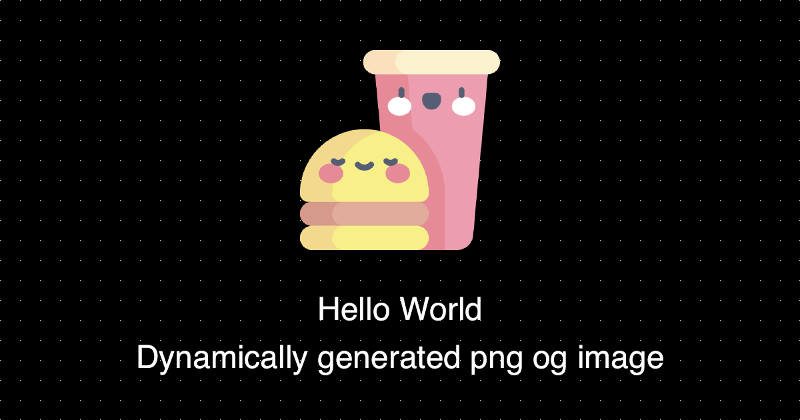

# OgImgGen

Og image generation middleware for .net core with built in caching

Available on nuget package manager [Nuget package](https://www.nuget.org/packages/OgImgGen/1.0.1)

.net CLI: `dotnet add package OgImgGen --version 1.0.1`

## Usage example

Query the required og image:

`https://localhost:5001/ogimg.png?topText=Hello%20World&bottomText=Dynamically%20generated%20png%20og%20image`

Enjoy the result:



## Setup

Register in the Configure method

```csharp
app.UseResponseCaching();

app.UseOgImgGen("/ogImg.png", "default-image.png", "font-you-want-to-use.ttf");
```

UseOgImgGen accepts 3 properties

- path, where the image will be generated
- defaultImage location, the location for an existing image
- font file location, the font to render on image

## Query options

| query option | default value                            | description                           | type            |
| ------------ | ---------------------------------------- | ------------------------------------- | --------------- |
| topText      |                                          | first line of the text                | string?         |
| bottomText   |                                          | second line of the text               | string?         |
| theme        | dark                                     | defines the background and text color | "dark"\|"light" |
| image        | defaultImage from the UseOgImgGen method | a relative path to the image file     | string?         |
